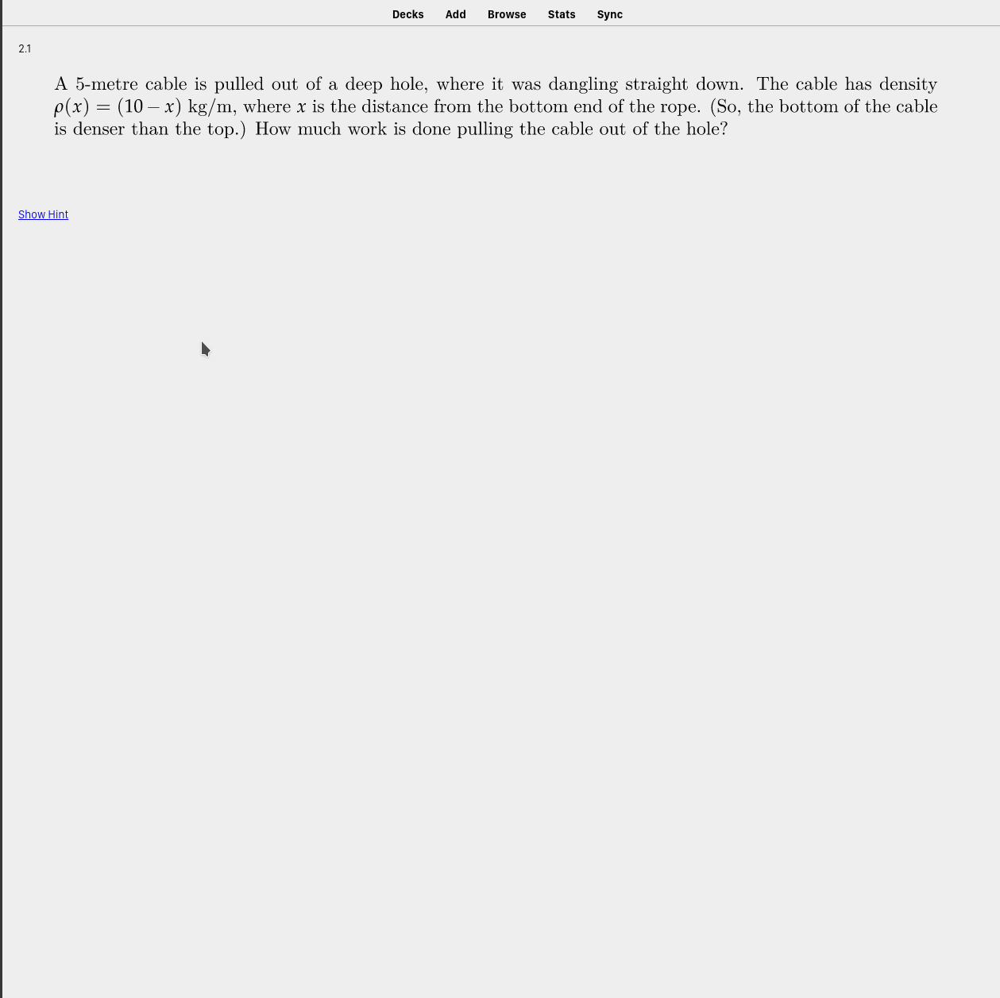

# Anki CLP

This is a tool I built in January 2020 to automate my studying in math courses. It parses the questions from any UBC CLP Textbook to generate [Anki](https://en.wikipedia.org/wiki/Anki_(software)) cards.



## Usage
1. Download the [source files](http://www.math.ubc.ca/~CLP/src/) for your CLP of choice.
2. Run `python ./genclp.py <target files>` where `<target-files>` correspond to the problem book .tex files of choice.

## Installation

Unfortunately, it is rather... complex to run this script since much massaging must be performed to get Anki to cooperate. This should be everything that's needed to get this set up on Linux, but if you encounter any difficulties feel free to submit an issue.

### Install the macros

For security reasons, Anki does not allow new commands to be defined in headers. For this reason, we must install a custom package.

Copy `clpmacros.sty` to your TeX directory. This can be done either locally or system-wide. Locate your TeX directory by running.

- System-wide: type `kpsewhich -var-value TEXMFLOCAL` in the terminal.

- Locally: type `kpsewhich -var-value TEXMFHOME` in the terminal.

For me, this was `/usr/share/texmf/tex/latex/custom-tex-packages/clpmacros.sty`

Test your installation by running `kpsewhich clpmacros.sty`

### Get Anki to build the cards

1. Install [pdf2svg](https://github.com/dawbarton/pdf2svg) and [LibRSVG](https://wiki.gnome.org/Projects/LibRsvg) using your package manager of choice to build LaTeX as svg.

2. Install [Edit LaTeX build process](https://ankiweb.net/shared/info/937148547) from AnkiWeb.

3. Copy the following to the configuration of `Edit LaTeX build process` under `Tools->Add-Ons`.

```
{
    "pngCommands": [
        [
            "latex",
            "-interaction=nonstopmode",
            "tmp.tex"
        ],
        [
            "dvipng",
            "-D",
            "200",
            "-T",
            "tight",
            "tmp.dvi",
            "-o",
            "tmp.png"
        ]
    ],
    "svgCommands": [
        [
            "xelatex",
            "-interaction=nonstopmode",
            "tmp.tex"
        ],
        [
            "pdf2svg",
            "tmp.pdf",
            "tmp-unscaled-svg"
        ],
        [
            "rsvg-convert",
            "--zoom=2",
            "--format=svg",
            "tmp-unscaled-svg",
            "-o",
            "tmp.svg"
        ]
    ]
}
```
